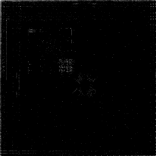
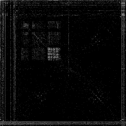
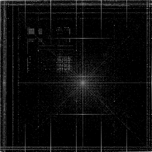
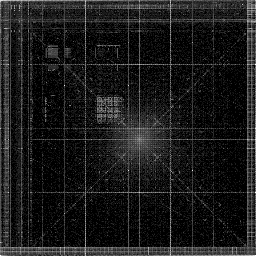
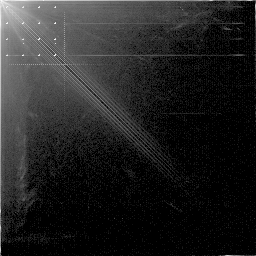
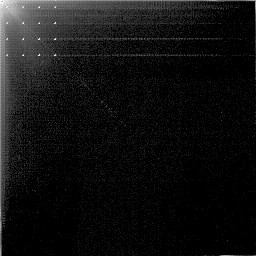

# Binary Visualization

Toy Rust program of the dynamic binary visualization from Christopher Domas talk: https://www.youtube.com/watch?v=4bM3Gut1hIk

Essentially, a byte stream is loaded from which a pair of consecutive bytes are extracted and are interpreted as a 2D coordinate

Each coordinate is counted and exported as image.

It is shown that different file types observer very different visual results, such as images, text.
Here I run it on some font files (ttf, otf), given the font spec layout are more or less the same it is as expected that we 
observer very similar results, but still there are some interesting patterns.

## Run

```console
$ cargo run --release --bin va-img -- <path-to-input> <output.png>
```

## Results on some fonts

### On a simple `en` small font



(QanelasSoftDemo)

### On more complete fonts




(left to right: Roboto, iosevka, SF Mono)

### On patched (Nerd) font



(left to right: CommitMono Nerd, LigaSF Nerd)

### On some Chinese fonts




(left to right: FZLTZHK 方正兰亭中黑, FZXBSFW  方正小标宋繁体)

